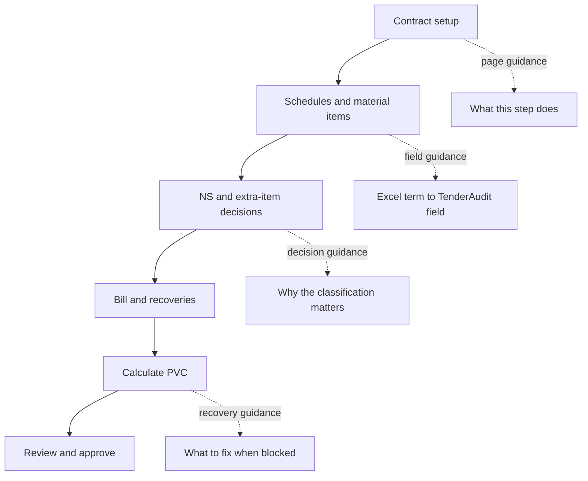

# Layered First-User Help - Plan

## Goal Capsule

- **Objective:** Help a contractor principal move from a manual Excel PVC workflow to TenderAudit and complete one real contract-to-PVC journey with no help or only occasional clarification.
- **Product authority:** `PRODUCT.md` defines PVC domain behavior; this contract defines only the pre-demo guidance experience.
- **Open blockers:** None for planning. The existing lack of bill-line entry UI is a known product limitation that guidance must describe honestly rather than conceal.

---

## Product Contract

### Summary

Add layered, contextual guidance to the three highest-risk moments in the first TenderAudit journey: contract setup, Excel item import and classification, and bill-to-PVC calculation.
Keep the guidance visible when it prevents consequential mistakes and reveal supplementary explanation only when requested.

### Problem Frame

The first external user is a contractor principal who understands PVC deeply and currently runs the company's workflow manually in Microsoft Excel.
He is new to TenderAudit's structured contract, schedule, item-classification, and immutable-run model.
No live contractor usability evidence exists yet, so the pre-demo work must concentrate on low-regret comprehension and correctness risks instead of building a broad onboarding system from assumptions.

Current help is scattered across grid-header tooltips, isolated form notes, validation messages, and workflow copy.
The product does not yet give the user a coherent view of where they are in the end-to-end PVC journey or consistently translate familiar Excel concepts into TenderAudit fields.

### Key Decisions

- **Layered contextual help is the default** (session-settled: user-directed — chosen over a guided tour and a full Excel-companion interface: it remains available without blocking a domain expert or creating a second permanent interface).
- **Pre-demo coverage is limited to three protected moments** (session-settled: user-approved — chosen over app-wide help coverage: contract setup, item import/classification, and bill-to-PVC calculation carry the largest comprehension and correctness risk before any live evidence exists).
- **The user is a PVC expert, not a novice.** Guidance translates product structure and action consequences without teaching basic PVC concepts.
- **Critical guidance stays in the page.** Facts that can change the calculation or block progress cannot exist only in hover help; supplementary definitions may use on-demand explanations.
- **No onboarding-completion state is introduced before the demo.** The experience is route- and context-aware rather than a forced sequence that must be dismissed or remembered.

The guidance model follows this shape:

### Requirements

**Journey orientation**

- R1. Relevant contract, item, bill, and run screens must show the six-stage PVC journey and clearly identify the user's current stage.
- R2. Each protected moment must state what happens on the current screen and what successful completion enables next.

**Contract and schedule setup**

- R3. Contract and schedule forms must explain fields that can materially affect every later run, including base month, PVC applicability, schedule type, overall rebate, and bid discount.
- R4. Percentage-like values must state the accepted input convention next to the field so a user cannot reasonably mistake a decimal for a whole percentage.

**Excel import and item classification**

- R5. The Excel importer must expose its progression as source selection, sheet and header confirmation, column mapping, and preview before rows are added.
- R6. Import guidance must selectively pair familiar workbook labels with TenderAudit concepts for ambiguous fields such as original quantity, base rate, and agreement rate.
- R7. Item guidance must explain the calculation consequence of cement, steel subtype, NS, and ExtraNS classifications at the point where each decision is made.
- R8. Invalid or incomplete classifications must identify the affected item, state why progress is blocked, and point to the decision the user must change.

**Bill-to-PVC calculation**

- R9. Bill guidance must explain that measurement date determines the rolling quarter, gross amount comes from the on-account Measurement Book total, and only selected recoveries reduce the PVC base.
- R10. The Calculate PVC action must describe its real effect and prerequisites without claiming that the run creates bill-line inputs that do not exist.
- R11. A blocked run must preserve the engine's actionable reasons and connect each reason to the screen or decision where it can be resolved.
- R12. Result guidance must explain total PVC, quarter used, W derivation, approval immutability, and why approval unlocks export.

**Content and interaction quality**

- R13. Guidance must use contractor-facing language and familiar Excel vocabulary without exposing implementation terminology.
- R14. Calculation-critical guidance must remain visible and readable without hover, while supplementary explanations must be keyboard- and screen-reader-accessible.
- R15. Guidance must never force a tour, obscure the form, or prevent an experienced user from acting immediately.

### Key Flows

- F1. First contract setup
  - **Trigger:** The contractor opens the new-contract form in an empty tenant.
  - **Steps:** The journey indicator marks Contract; page guidance frames the goal; critical field guidance explains calculation consequences; successful creation points to schedules and items.
  - **Outcome:** The contractor creates a structurally valid contract without silently misunderstanding base month, rebate, or PVC applicability.
  - **Covered by:** R1–R4, R13–R15.

- F2. Excel items import and classification
  - **Trigger:** The contractor selects Import rows from a schedule's item grid.
  - **Steps:** The importer exposes its stages; source headers are translated into TenderAudit fields; classification help explains cement, steel, NS, and ExtraNS consequences; validation identifies required corrections before commit.
  - **Outcome:** The contractor can verify what will be imported and why each PVC classification matters before rows are added.
  - **Covered by:** R1–R2, R5–R8, R13–R15.

- F3. Bill calculation and review
  - **Trigger:** The contractor creates or opens a bill and prepares to calculate PVC.
  - **Steps:** Inline guidance explains dates, gross amount, and recovery eligibility; Calculate PVC states what it will do; blocking errors point back to corrective actions; result guidance leads through review, approval, and export.
  - **Outcome:** The contractor reaches a PVC value or understands exactly what must be corrected before a value can be produced.
  - **Covered by:** R1–R2, R9–R15.

### Acceptance Examples

- AE1. **Covers R3–R4.** Given a contractor entering a five-percent overall rebate, when he reaches the rebate field, then the accepted input format and its equivalent percentage are visible before submission.
- AE2. **Covers R5–R6.** Given an uploaded workbook whose header says `Agreement Qty`, when the mapping step appears, then the user can see that it maps to Original quantity and what that TenderAudit field means.
- AE3. **Covers R7–R8.** Given an item classified as both cement and a steel subtype, when validation runs, then the message explains that one item can belong to only one PVC bucket and identifies what must be changed.
- AE4. **Covers R9–R11.** Given a PVC run blocked by an undecided extra item or missing index month, when the error appears, then the contractor can identify the blocking decision and where to resolve it without interpreting a generic engine failure.
- AE5. **Covers R12 and R15.** Given a successful draft run, when the contractor opens the result, then total PVC, quarter used, W derivation, approval consequence, and export gate are understandable without a forced walkthrough.

### Success Criteria

- During the first live contractor demo, the user completes contract setup through PVC result with no help or only occasional clarification.
- The demo reveals no silent misunderstanding of base month, percentage input, item classification, measurement date, recovery eligibility, or approval immutability.
- The facilitator can distinguish missing product guidance from a missing product capability and record each confusion for the next iteration.

### Scope Boundaries

- No searchable help centre, video library, chatbot, or long-form PVC tutorial before the first demo.
- No forced product tour, coach-mark sequence, persisted onboarding checklist, analytics, or onboarding database state.
- No guidance work for login, Index Manager, Document Vault, or unrelated administrative screens in this pre-demo slice.
- No engine, formula, index, tenant-provisioning, or approval-behavior changes.
- No attempt to hide or solve the existing absence of bill-line entry UI; the help copy must remain accurate about that limitation.
- Excel terminology is a selective translation aid, not a permanent parallel interface or a promise to reproduce arbitrary workbook layouts.

### Dependencies and Assumptions

- The first demo uses an empty tenant and one of the contractor's real contracts, following `tasks/walkthrough-first-user.md`.
- The contractor is fluent in manual PVC calculation but unfamiliar with TenderAudit's workflow.
- Pre-demo guidance is intentionally based on product risk rather than observed usability evidence; findings from the live demo should drive the next scope decision.

### Sources and Research

- `PRODUCT.md` defines the actor pains, PVC workflow, and correctness constraints.
- `tasks/walkthrough-first-user.md` defines the first live session and documents the known bill-line limitation.
- `frontend/components/contracts/ItemsGrid.tsx:107` shows the existing grid-header tooltip pattern.
- `frontend/components/contracts/ImportRowsModal.tsx:204` shows the existing multi-stage Excel import behavior.
- `frontend/components/contracts/BillForm.tsx:131` shows the existing gross-amount help note.
- `frontend/app/(app)/contracts/[id]/bills/[billId]/page.tsx:224` shows current PVC action guidance and the inaccurate bill-line claim that must not survive this work.
- `frontend/components/shell/ShellState.tsx:26` confirms current shell state is transient and contains no onboarding-completion model.
